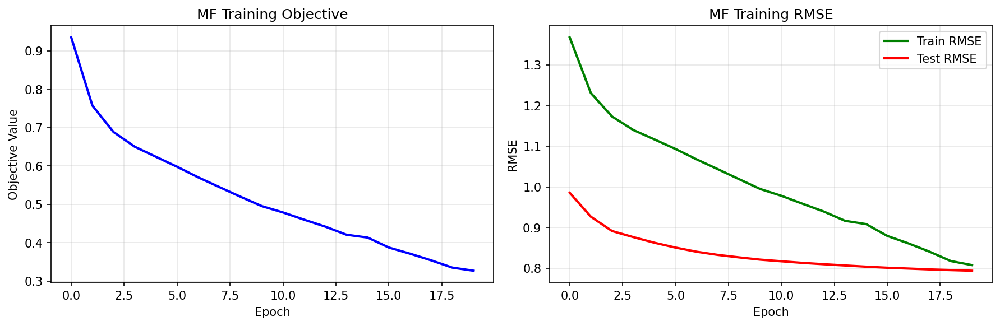

# Personalized Recommendation System
This is my assignment for the course Big Data Intelligence at Tsinghua University.
## Author
Dang Chau Anh
## Overview
This project implements a personalized movie recommendation system using a subset of the Netflix Prize dataset. The dataset includes 10,000 users, 10,000 movies, and more than 8 million user–movie ratings. The goal is to build a model capable of predicting how a user will rate unseen movies. The recommendation system is trained on 80% of user behavior data and evaluated on the remaining 20%.

## Dataset Description

### 1. users.txt
- Contains 10,000 lines
- Each line: a user ID (integer)
- Represents all users in the project

### 2. movie_titles.txt
- Format per line: `movie_id, year, movie_title`
- Includes movie metadata (optional for the basic task)

### 3. netflix_train.txt
- Contains 6.89 million ratings
- Format: `user_id movie_id rating date`
- Data separated by spaces
- Used as the training set (80%)

### 4. netflix_test.txt
- Contains ~1.72 million ratings
- Same format as training data
- Used as the test set (20%)

## Features Implemented

- Data loading and preprocessing
- Baseline models (global mean, user mean, item mean)
- Implementation of Collaborative Filtering (user-based)
- Implementation of Matrix Factorization with Gradient Descent
- Evaluation using RMSE

## Approach

This project explores recommendation algorithms including:

### 1. Baseline Model
Predicts rating using global average + user bias + movie bias.

### 2. Collaborative Filtering
- **User-based CF**: recommends movies rated by similar users
- **Item-based CF**: recommends movies similar to those a user liked
- Uses methods such as cosine similarity or Pearson correlation

### 3. Matrix Factorization
Uses latent factor models (SVD or SGD-based MF)
Scales well with 10M+ ratings

## Evaluation

The model performance is evaluated on the test set using:

### RMSE (Root Mean Square Error)

### Matrix Factorization Hyperparameter Tuning Results

| Latent Factors (k) | Regularization (λ) | Final RMSE |
|--------------------|--------------------|------------|
| 100 | 0.010 | **0.7933** |
| 50 | 0.010 | 0.7969 |
| 10 | 0.010 | 0.8168 |
| 100 | 0.001 | 0.8277 |

### RMSE Comparison Across Methods

| Method | RMSE |
|--------|------|
| Global Mean Baseline | 1.1060 |
| User Mean Baseline | 0.9881 |
| Item Mean Baseline | 1.0275 |
| User-Based Collaborative Filtering | 0.9494 |
| Matrix Factorization (Final) | **0.7933** |

## Optional Enhancements
- You may optionally extend the project with:
- Using movie metadata for content-based filtering
- Hybrid CF + content models
- Time-aware rating prediction
- Personalized top-N recommendation lists

## Notes
This project is submitted as coursework for the Big Data Intelligence course at Tsinghua University.
